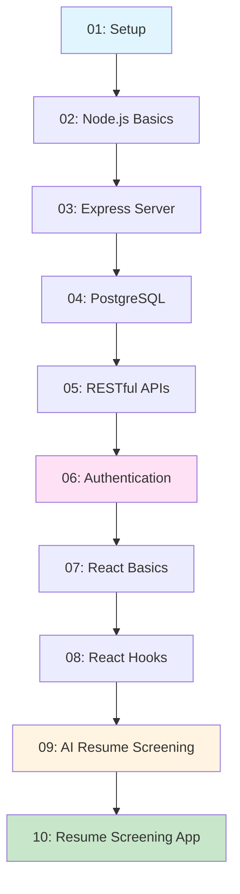

# Full Stack Development Workshop

- React + Node.js + PostgreSQL + AI

## Workshop Structure

A 4-hour progressive workshop divided into 10 interconnected topics, each building upon the previous one. Each topic will have its own folder containing:

- `README.md` - Concept explanation, learning objectives, and theory
- Code examples demonstrating the concepts
- Progressive exercises that connect to the next topic

## Topic Breakdown (4 hours total)

### Topic 1: Introduction & Environment Setup (20 min)

**Folder:** `01-introduction-setup/`

- Workshop overview and learning path
- Installing Node.js, npm, PostgreSQL
- Setting up development environment
- Project structure overview
- **Files:** `README.md`, `setup-guide.md`, `package.json` template

### Topic 2: Node.js Fundamentals (25 min)

**Folder:** `02-nodejs-basics/`

- Node.js runtime and modules
- CommonJS vs ES6 modules
- File system operations
- Environment variables
- **Files:** `README.md`, `modules-example.js`, `fs-example.js`, `env-example.js`

### Topic 3: Express.js Server Setup (25 min)

**Folder:** `03-express-server/`

- Creating Express server
- Routing basics
- Middleware concepts
- Request/Response handling
- **Files:** `README.md`, `server.js`, `routes-example.js`, `middleware-example.js`

### Topic 4: PostgreSQL Database (35 min)

**Folder:** `04-postgresql-database/`

- PostgreSQL installation and setup
- Database design and schema
- SQL queries (SELECT, INSERT, UPDATE, DELETE)
- Using pg (node-postgres) library
- Connection pooling
- **Files:** `README.md`, `database-setup.sql`, `db-connection.js`, `queries-example.js`, `schema.sql`

### Topic 5: RESTful API Development (35 min)

**Folder:** `05-restful-apis/`

- REST principles
- CRUD operations
- API endpoints design
- Error handling
- Request validation
- **Files:** `README.md`, `api-routes.js`, `controllers-example.js`, `error-handler.js`, `validation-example.js`

### Topic 6: Authentication & Authorization (30 min)

**Folder:** `06-authentication-authorization/`

- User registration and login
- Password hashing (bcrypt)
- JWT tokens
- Protected routes and middleware
- Session management
- **Files:** `README.md`, `auth-controller.js`, `auth-middleware.js`, `jwt-utils.js`, `password-hashing.js`

### Topic 7: React Basics & Components (25 min)

**Folder:** `07-react-basics/`

- React introduction and JSX
- Functional components
- Props and component composition
- Event handling
- Form handling
- **Files:** `README.md`, `App.jsx`, `components/Button.jsx`, `components/Form.jsx`, `components-example/`

### Topic 8: React Hooks & State Management (25 min)

**Folder:** `08-react-hooks-state/`

- useState hook
- useEffect hook
- Custom hooks
- Context API for global state
- **Files:** `README.md`, `hooks-example.jsx`, `useState-example.jsx`, `useEffect-example.jsx`, `context-example.jsx`

### Topic 9: AI Integration & Resume Screening (30 min)

**Folder:** `09-ai-integration-resume-screening/`

- Introduction to Generative AI APIs (OpenAI/Anthropic)
- Setting up AI API clients
- Resume parsing and extraction
- AI-powered resume screening and scoring
- AI agents for candidate analysis
- Prompt engineering for resume analysis
- **Files:** `README.md`, `ai-client.js`, `resume-parser.js`, `resume-screener.js`, `screening-agent.js`, `prompt-templates.js`

### Topic 10: Final Project - Resume Screening & Profile Management (20 min)

**Folder:** `10-final-project/`

- Complete full-stack Resume Screening application
- Features:
- User registration and login
- User profile creation and management (CRUD)
- Resume upload and storage
- AI-powered resume screening and analysis
- Resume scoring and recommendations
- Profile dashboard
- Search and filter profiles
- Integration of all concepts (Full Stack + Authentication + AI)
- Best practices summary
- **Files:** `README.md`, `backend/` (complete server with auth and AI), `frontend/` (complete React app), `database/` (schema with users, profiles, resumes), `agents/` (AI screening agents)

## Project Flow Diagram




## Final Project: Resume Screening & Profile Management

### Core Features:

1. **Authentication System**

- User registration with email/password
- Secure login with JWT tokens
- Protected routes and middleware
- Password reset functionality

2. **User Profile Management (CRUD)**

- Create user profile (name, email, contact info)
- Read/view profile details
- Update profile information
- Delete profile (soft delete)

3. **Resume Management**

- Upload resume files (PDF, DOCX)
- Store resume metadata in database
- View uploaded resumes
- Update resume information
- Delete resumes

4. **AI-Powered Resume Screening**

- **Resume Parser Agent**: Extract information from resumes (skills, experience, education)
- **Screening Agent**: Analyze resume against job requirements
- **Scoring Agent**: Generate match scores and recommendations
- **Summary Agent**: Create candidate summaries
- Real-time screening results

5. **Dashboard & Search**

- User dashboard with profile overview
- Resume screening history
- Search and filter profiles
- View screening scores and insights

### Database Schema:

- `users` - User accounts (email, hashed password)
- `profiles` - User profile information (name, phone, address, etc.)
- `resumes` - Resume files and metadata
- `screening_results` - AI screening analysis and scores

## Implementation Details

### Root Structure

```javascript
workshop/
├── 01-introduction-setup/
├── 02-nodejs-basics/
├── 03-express-server/
├── 04-postgresql-database/
├── 05-restful-apis/
├── 06-authentication-authorization/
├── 07-react-basics/
├── 08-react-hooks-state/
├── 09-ai-integration-resume-screening/
├── 10-final-project/
└── WORKSHOP-OVERVIEW.md
```


### Each Topic Folder Contains:

- `README.md` - Main documentation with:
- Learning objectives
- Concept explanation
- Code walkthrough
- Links to previous/next topics
- Exercises
- Code examples (`.js`, `.jsx`, `.sql` files)
- Progressive examples that build on previous topics

### Key Features:

1. **Progressive Learning**: Each topic references and builds upon previous topics
2. **Hands-on Code**: Every concept demonstrated with working code
3. **Complete Examples**: From simple to complex, showing real-world patterns
4. **Authentication**: Secure user authentication and authorization
5. **CRUD Operations**: Complete Create, Read, Update, Delete examples
6. **AI Integration**: Modern AI/LLM integration for resume screening
7. **Final Integration**: Complete application demonstrating all concepts

### Workshop Flow:

- Topics 1-5: Backend development (Node.js → Express → PostgreSQL → APIs)
- Topic 6: Authentication (registration, login, JWT)
- Topics 7-8: Frontend development (React basics → Hooks)
- Topic 9: AI Integration (resume parsing, screening, agents)
- Topic 10: Complete Resume Screening application

## Files to Create

1. Root `WORKSHOP-OVERVIEW.md` - Workshop agenda, prerequisites, and learning path
2. 10 topic folders, each with:

- `README.md` (comprehensive guide)
- Relevant code examples
- Progressive exercises

3. Code examples that demonstrate concepts and connect to next topics
4. Final project with complete working Resume Screening application

## Code Examples Will Include:

- Setup scripts and configuration files
- Server implementations
- Database schemas and queries (users, profiles, resumes)
- Authentication middleware and controllers
- CRUD API endpoints
- React components and hooks
- Form handling (registration, login, profile forms)
- API integration code
- AI client setup and configuration